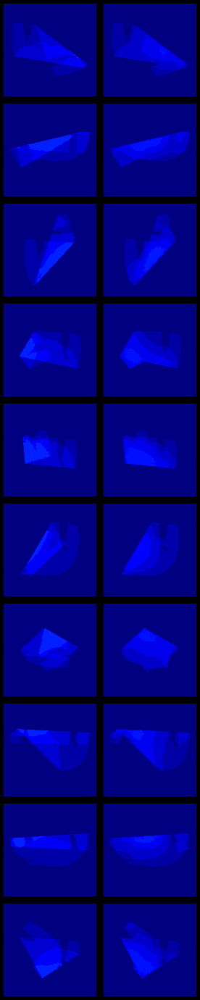

## Training a U-Net model

Prepare a dataset (num_samples is the size of dataset, by default 10000). It yields three files: `dataset_train_unet.pkl`, `dataset_validate_unet.pkl`, `dataset_test_unet.pkl`.

```
python generate_data_unet.py num_samples
```

Train the model (training_dataset is the file name of dataset, by default `dataset_train_unet.pkl`)

```
python train_unet.py training_dataset
```

Evaluate the model (model_name is the file name of model, by default `unet_trained.h5`, validation_dataset is the file name of dataset, by default `dataset_validate_unet.pkl`)

```
python validate_unet.py model_name validation_dataset
```

Evaluation reports the model metrics and produces an image `validation.png` with the comparison of ground truth and model prediction for the first 10 images in the dataset.

Example output for a dataset with 10k images and max 2 folds:

<p align="center">
 
</p>
